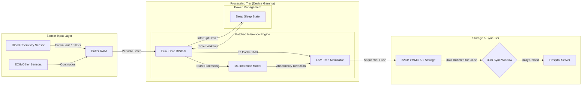

```mermaid
graph LR
    subgraph "Sensor Input Layer"
        S1[Blood Chemistry Sensor] --> |Continuous 10KB/s| B1[Buffer RAM]
        S2[ECG/Other Sensors] --> |Continuous| B1
    end

    subgraph "Processing Tier (Device Gamma)"
        B1 --> |Periodic Batch| P1[Dual-Core RISC-V]
        P1 --> |L2 Cache 2MB| L1[LSM Tree MemTable]
        
        subgraph "Batched Inference Engine"
            P1 --> |Burst Processing| M1[ML Inference Model]
            M1 --> |Abnormality Detection| L1
        end
        
        subgraph "Power Management"
            P1 --> |Interrupt Driven| D1[Deep Sleep State]
            D1 --> |Timer Wakeup| P1
        end
    end

    subgraph "Storage & Sync Tier"
        L1 --> |Sequential Flush| E1[32GB eMMC 5.1 Storage]
        E1 --> |Data Buffered for 23.5h| T1{30m Sync Window}
        T1 --> |Daily Upload| H1[Hospital Server]
    end

```

